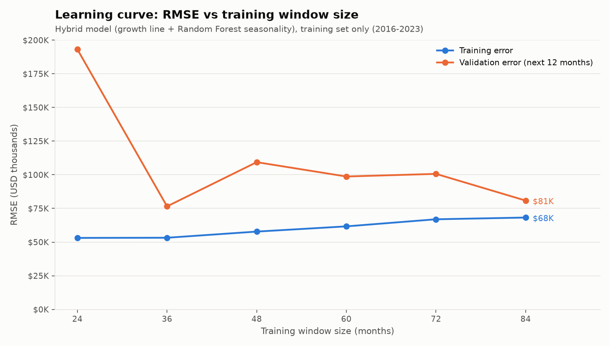

# HealthCore Sales Forecast: Model Evaluation Report

Model evaluated: log-linear growth line + Random Forest seasonality (`HybridSalesModel`,
`data/pipelines/sales_model.py`). All numbers below come from the **training set only**
(2016-01 to 2023-12, 96 months). The 2 held-out test years (2024-2025) were not used.

Reproduce everything with:

    python -m data.pipelines.evaluate_sales_model
    pytest tests/pipelines/test_temporal_cv.py

Raw numbers: `data/eval/evaluation_metrics.json`.

## Summary

| Question             | Answer                                                                                                                                                                                            |
| -------------------- | ------------------------------------------------------------------------------------------------------------------------------------------------------------------------------------------------- |
| 1. Fit diagnosis     | **Well fitted**, with a small, shrinking gap between training and validation error.                                                                                                               |
| 2. Stability         | Validation RMSE is **$160,101 ± $90,355** across 5 temporal folds. The large spread comes from the first two folds, which have too little history. The last two folds agree closely (about $89K). |
| 3. Corrective action | No change to the model. Do not trust forecasts built on fewer than 36 months of history.                                                                                                          |

## 1. Fit diagnosis

How the curve was built: for each training window size n, the model is fitted on the
first n months, then scored on those same n months (training error) and on the **next
12 months** (validation error). Every validation window comes after its training window.
sklearn's `learning_curve` was not used because, combined with `TimeSeriesSplit`, it caps
the training size at the smallest fold (16 months), which is too short to see a full
seasonal cycle.

| Training months | Train RMSE | Validation RMSE |      Gap |
| --------------: | ---------: | --------------: | -------: |
|              24 |    $53,106 |        $193,149 | $140,043 |
|              36 |    $53,229 |         $76,533 |  $23,304 |
|              48 |    $57,798 |        $109,363 |  $51,565 |
|              60 |    $61,677 |         $98,716 |  $37,039 |
|              72 |    $66,946 |        $100,664 |  $33,718 |
|              84 |    $68,228 |         $80,838 |  $12,610 |

Interpretation: the curve matches the **"both curves converge at low, close error"**
pattern, not underfitting and not overfitting.

- **Not underfitting.** The training error is low and flat (about $53K to $68K, roughly
  2% to 3% of the average monthly revenue of $2.75M). Adding data does not push the
  training error down, because what is left is month-to-month noise that calendar
  features cannot explain.
- **Not strong overfitting.** The validation error falls from $193K at 24 months to $81K
  at 84 months, and the gap between the curves shrinks from $140K to about $13K. A
  model that memorizes its training data would keep a wide, persistent gap.
- **Slight rise in training error** as the window grows (from $53K to $68K) is expected:
  a model with a fixed shape has to explain more years with the same seasonal pattern.

Limitation: each point uses a single 12-month validation window, so the validation
curve is noisy (for example the bump at 48 months). The overall downward trend and the
narrowing gap are the reliable signal, not any single point.

## 2. Stability (temporal cross-validation)

`TimeSeriesSplit(n_splits=5)`, expanding window, no shuffling, training set only.

| Fold | Training window            | Validation window  |  Val MAE | Val RMSE |
| ---: | -------------------------- | ------------------ | -------: | -------: |
|    1 | 2016-01 to 2017-04 (16 mo) | 2017-05 to 2018-08 | $289,078 | $332,511 |
|    2 | 2016-01 to 2018-08 (32 mo) | 2018-09 to 2019-12 | $142,778 | $161,838 |
|    3 | 2016-01 to 2019-12 (48 mo) | 2020-01 to 2021-04 | $101,592 | $127,639 |
|    4 | 2016-01 to 2021-04 (64 mo) | 2021-05 to 2022-08 |  $72,561 |  $88,528 |
|    5 | 2016-01 to 2022-08 (80 mo) | 2022-09 to 2023-12 |  $76,510 |  $89,988 |

| Metric | Training (mean ± std) | Validation (mean ± std) |
| ------ | --------------------- | ----------------------- |
| MAE    | $55,188 ± $7,835      | $136,504 ± $80,281      |
| RMSE   | $67,813 ± $12,827     | $160,101 ± $90,355      |

Reading the variance: the standard deviation of the validation error is large (more than
half of its mean), so a single average would hide real instability. The instability is
concentrated in the **early folds**, where the model has only 16 to 32 months of
history, which is barely more than one full seasonal cycle. Folds 4 and 5 (64 and 80
months of history) are nearly identical ($88,528 and $89,988 RMSE). The error falls as
history grows, which is the same message as the learning curve.

Sanity check, not used for tuning: the test-set RMSE reported in the previous project
($94,735) is in line with the two most recent folds ($88K to $90K).

Leakage check: the model uses calendar-only features (month, sin/cos of month, Q4 flag,
summer-dip flag, time index). There are no lag or rolling features, so nothing in a
validation window can leak into a feature. The model is also fitted from scratch on
each fold's training rows, so its time origin and growth line never see validation months.

## 3. Primary metric: RMSE (MAE reported alongside)

Both metrics are computed on training and validation (tables above).

- **MAE** treats every miss equally.
- **RMSE** penalizes large misses disproportionately.

**RMSE is the primary metric.** Note on the business context: `CONTEXT.md` in this
repository describes incidents and suppliers and does not state the cost of a forecast
error, so this choice rests on a stated assumption, not on a documented figure. The
documented business concern (`data/pipelines/PIPELINE_DESIGN.md`) is that leadership
tracks **critical stockouts**. If revenue is under-forecast in a peak month such as Q4,
supply planning is under-sized and stockouts follow. One large miss in a peak month
costs far more than several small misses, so a metric that punishes large errors more
heavily matches that risk. MAE is still reported because it is easier to read as "the
typical miss in USD".

If Finance confirms that over- and under-forecasting cost about the same and large
misses are rare, MAE would be the better primary metric.

## 4. Corrective action

Diagnosis is "well fitted", so no change to the algorithm or its hyperparameters is
justified by the evidence. Changing `n_estimators` or `min_samples_leaf` here would be
tuning without a problem to fix.

The evidence does point to one concrete operational rule:

- **Require at least 36 months of history before using a forecast.** The learning curve
  shows validation RMSE dropping from $193,149 (24 months) to $76,533 (36 months), and
  CV folds 1 and 2 (16 and 32 months) carry almost all of the instability. This matters
  if the model is ever applied to a new clinic or a new product line with a short history.

Follow-up to monitor, not an action yet: the gap between the curves at 84 months is
$12,610 (about 19% of the training RMSE). Re-run this evaluation when new months of data
arrive. If the gap widens instead of shrinking, that would be the signal for
regularization (for example a larger `min_samples_leaf`).
