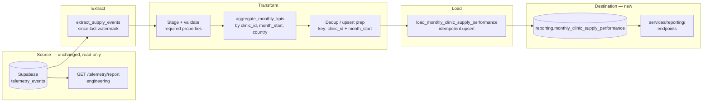

# Business Performance Data Pipeline — Design Document

**Company:** HealthCore
**Deliverable:** Monthly Clinic Supply Performance Report
**Status:** Design only — no orchestration code in this milestone

---

## 1. Current State

HealthCore's telemetry system captures inventory events into `public.telemetry_events` (Supabase), including the five mandatory metrics defined in the telemetry CONTEXT: `inbound_order_created`, `outbound_order_created`, `stock_threshold_triggered`, `direct_stock_edit_rejected`, and `supply_expiry_flagged`.

`services/telemetry/analysis.py` and `GET /telemetry/report` already answer **engineering** questions from this data — event volume per day, error rate by type, and API latency. They do not, and are not meant to, answer the **business** question Dr. Okonkwo (CEO) and Claire (Chief Compliance Officer) need answered every month: how much did each of the 12 clinics spend on supplies, how many times did they run into critical stockouts, and how much supply is at risk of expiring.

Today that monthly view is produced manually — Dr. Okonkwo's team consolidates spreadsheets by hand before every board meeting. There is no execution log, no idempotent monthly aggregate table, and no reporting endpoint that exposes this data to a dashboard or export.

## 2. Purpose

Produce the monthly **Monthly Clinic Supply Performance Report** that feeds the CEO/CCO board pack, computing **Supply Cost per Clinic**, **Supply Consumption Volume**, **Critical Stockout Frequency**, and **Expiry Risk Count** into `reporting.monthly_clinic_supply_performance`, from the four mandatory telemetry events already defined in the data-pipelines CONTEXT (`inbound_order_created`, `outbound_order_created`, `stock_threshold_triggered`, `supply_expiry_flagged`).

## 3. Extraction Format

- **Source:** `telemetry_events` (Supabase Postgres), read-only. This pipeline never writes back to it.
- **Filter:** `event_type IN ('inbound_order_created', 'outbound_order_created', 'stock_threshold_triggered', 'supply_expiry_flagged')`, windowed by `created_at` against a stored watermark — never a full-table scan.
- **Schema prerequisite:** `inbound_order_created.properties` must carry a cost value (`total_cost`, or `unit_cost` combined with the existing `quantity`). This is an **additive field on an existing mandatory event**, not a new event type, and it must never describe or reference a patient.
- **Refresh frequency:** monthly, scheduled to run in the early hours of the 1st of each month (UTC) so the report is ready before the first working day, per the existing "automated board reporting pack" expectation. A manual/backfill trigger is also supported for reprocessing a specific past month.

## 4. Data Flow Diagram



**Key decisions:**
- Extraction uses a watermark (`last_processed_at` stored in `pipeline_runs`), not a full re-read every run.
- The technical report path (`services/telemetry/analysis.py`, `GET /telemetry/report`) stays completely untouched — this pipeline writes only into `reporting.*`.
- Load is a transactional upsert keyed on `(clinic_id, month_start)`, matching the `unique` constraint on the destination table.
- `USD` and `GBP` clinics are aggregated and stored as separate rows — never summed into one currency.

## 5. Update / Dedup Strategy

Telemetry events are append-only, but a month's aggregate row can legitimately change if events for that month arrive late (e.g. an `inbound_order_created` logged a few days after month-end due to a delayed vendor invoice).

**Mechanism: upsert by grain.**
`(clinic_id, month_start)` is the business key, matching the `unique (clinic_id, month_start)` constraint already defined in the destination table's DDL:

```sql
insert into reporting.monthly_clinic_supply_performance
  (clinic_id, country, month_start, total_supply_cost, supply_consumption_count,
   critical_stockout_count, expiry_risk_count, currency, computed_at)
values (...)
on conflict (clinic_id, month_start)
do update set
  total_supply_cost = excluded.total_supply_cost,
  supply_consumption_count = excluded.supply_consumption_count,
  critical_stockout_count = excluded.critical_stockout_count,
  expiry_risk_count = excluded.expiry_risk_count,
  currency = excluded.currency,
  computed_at = now();
```

To catch late-arriving events, each monthly run recomputes not just the current month but also a **2-month reprocessing window** (current month + previous month). Any recompute that changes a previously-published row is logged in `pipeline_runs` as an "amended" run, so Claire's compliance trail shows when and why a published number changed.

**Common mistake avoided:** this is not `SELECT DISTINCT` — the business key (`clinic_id`, `month_start`) is explicit, and late arrivals are handled by the reprocessing window rather than ignored.

## 6. Idempotency Strategy

**Failure scenario:** the pipeline fails after loading 7 of the network's 12 clinics into `reporting.monthly_clinic_supply_performance` for the current month.

**Recovery:**
1. Every run gets a `run_id` (UUID), logged at start in `pipeline_runs` along with the month(s) being processed.
2. `pipeline_runs.checkpoint` records the last completed phase (`extract`, `transform`, `load`) and, during `load`, which clinics have already been committed.
3. Each clinic's row is written via the transactional upsert above, keyed on `(clinic_id, month_start)`.
4. On retry: the pipeline re-runs the `load` phase for **all 12 clinics**, not just the missing 5. Because the upsert is idempotent, the 7 already-loaded clinics are simply overwritten with the same (or corrected) values — no duplicate rows are ever created, and the operation is safe to repeat any number of times.
5. `pipeline_runs.status` moves to `success` only once all 12 clinics for the target month(s) are confirmed loaded.

**Common mistake avoided:** the recovery plan does not just say "re-run the whole job" — it explains exactly why re-running the load phase against an upsert key cannot produce duplicate reporting rows.

## 7. Execution Log

| Field | Type | Audit justification |
|---|---|---|
| `run_id` | UUID | Correlates logs, alerts, and the specific board-pack month it produced. |
| `started_at` / `finished_at` | timestamptz (UTC) | SLA tracking — confirms the pack was ready before the first working day of the month. |
| `month_processed` | date (`month_start`) | Which reporting month(s) this run computed, including reprocessed prior months. |
| `clinics_loaded` | integer | Should equal 12 on a healthy run; a lower count signals a partial failure immediately. |
| `rows_extracted` | integer | Detects an empty or truncated source window (e.g. a watermark bug). |
| `status` | enum (`success`, `failed`, `partial`) | Drives alerting to the ops/compliance channel. |
| `error_summary` | string (nullable) | Human-readable failure reason for Claire's compliance review, without needing to read stack traces. |
| `pipeline_version` | semver / git sha | Reproducibility — ties a published number to the exact aggregation logic that produced it. |

(8 fields provided, exceeding the required minimum of 5.)

## 8. Prefect Mapping

| Prefect concept | Mapping |
|---|---|
| **Flow** | `monthly_clinic_supply_performance_flow` — the main scheduled run (1st of each month, UTC). *Optional, future scope:* `backfill_monthly_clinic_supply_performance_flow` for on-demand reprocessing of an arbitrary past month range. |
| **Tasks** (≥3) | `extract_supply_events`, `validate_supply_events`, `aggregate_monthly_kpis`, `load_monthly_clinic_supply_performance` |
| **States** | `Running` during extract/transform/load; `Completed` once `pipeline_runs.status = success` for all 12 clinics; `Failed` triggers an alert to the ops/compliance channel and preserves the checkpoint for retry. |
| **Blocks** | `SupabaseCredentials` (DB URL + service key); `PipelineConfig` (reprocessing window in months, expected clinic list, batch size). |

## 9. Application Integration

New module `services/reporting/`, kept separate from `services/telemetry/`. No aggregation logic lives inside `services/` — every endpoint delegates to a function in `data/pipelines/`.

| Endpoint | Calls from `data/pipelines/` |
|---|---|
| `GET /reporting/pipeline-runs/latest` | `get_latest_pipeline_run()` — status and metadata of the last run |
| `POST /reporting/pipeline-runs` | `trigger_pipeline_run()` → `monthly_clinic_supply_performance_flow()` |
| `GET /reporting/monthly-clinic-supply-performance` | `get_monthly_clinic_supply_performance(month_start)` — returns all 12 clinics' rows from `reporting.monthly_clinic_supply_performance` for the given (or most recent) month, in the response shape defined in the CONTEXT (per-clinic cost, consumption, stockouts, expiry risk, currency) |

---

## Compliance checklist (self-check against CONTEXT)

- [x] No field anywhere in this design (table, endpoint response, log) references a patient — everything is aggregated at `clinic`/`department` level.
- [x] `USD` and `GBP` are never summed together in one row.
- [x] `telemetry_events` is read-only; `services/telemetry/analysis.py` and `GET /telemetry/report` are untouched.
- [x] Destination lives under the `reporting` schema, not `public`.
- [x] Purpose names the CEO-facing business deliverable, not a technical metric.
